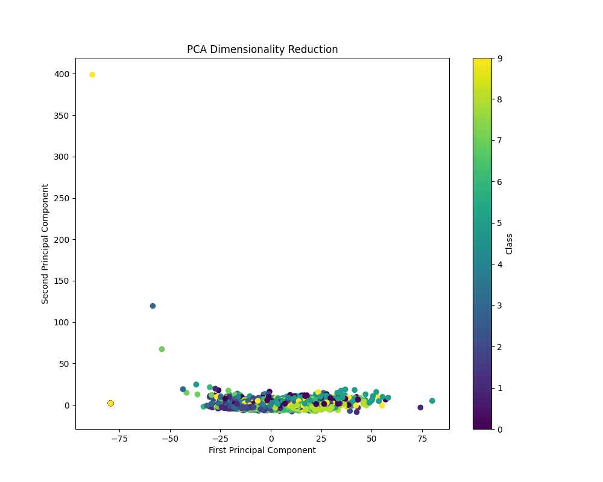
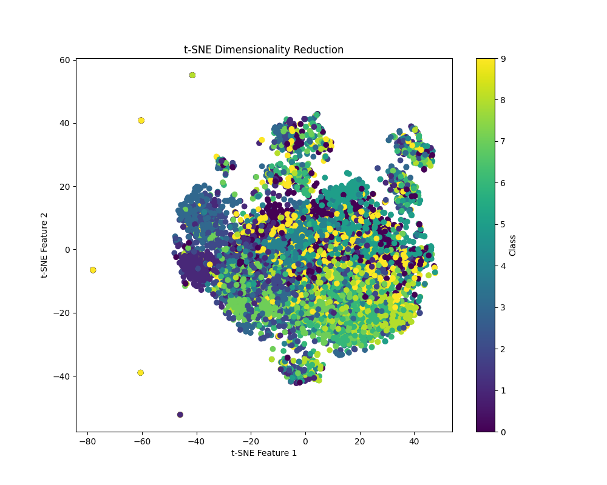
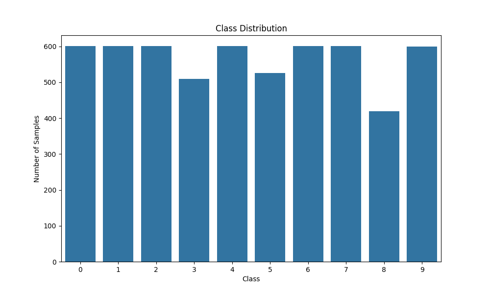
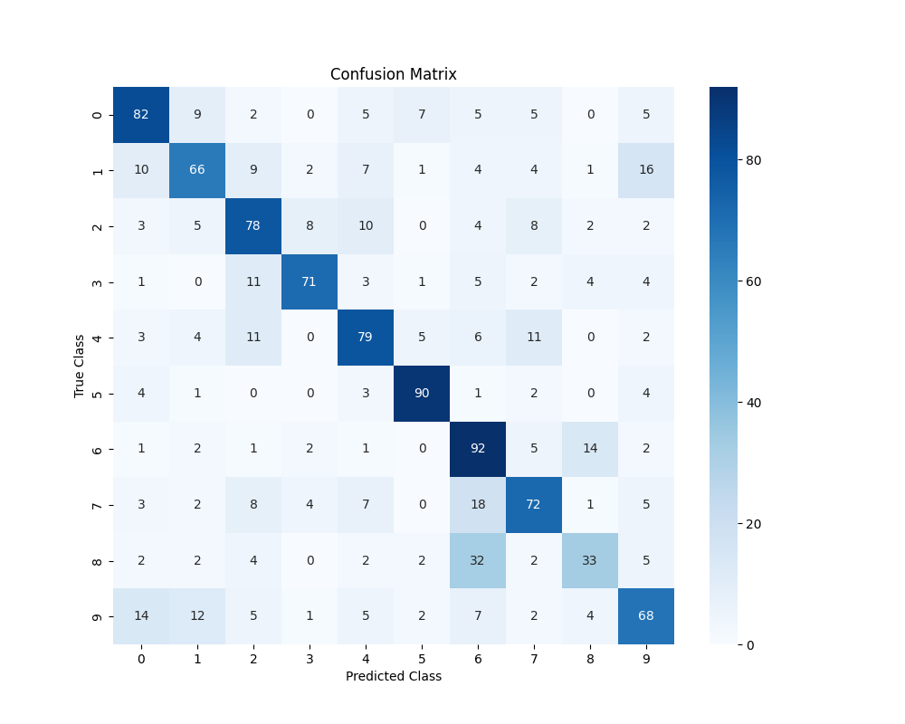

# Project Overview
This is the first homework of the course HKUSTGZ-AIAA-5032(https://www.kaggle.com/competitions/hkustgz-aiaa-5032-hw-1-spring-2025/overview), the project aims to classify videos into different categories using their audio features. We utilize MFCC features extracted from the audio and implement an ensemble of advanced machine learning models like XGBoost.
## Implementation Details

### Data Processing Pipeline

1. **Data Organization** (`split_data.py`)
   - Separates data into training/validation and test sets
   - Organizes MFCC features with corresponding labels
   - Creates structured directories for better data management

2. **Feature Engineering** (`train.py`)
   - Extracts comprehensive features from MFCC data:
     - Statistical features (mean, std, max, min, percentiles)
     - Temporal features (delta and delta-delta)
     - Sliding window features
     - Frequency domain features using FFT
   - Implements standardization for feature normalization

3. **Model Architecture**
    - XGBoost
    - Cross-validation

### Key Features

- Robust feature extraction pipeline
- Comprehensive model evaluation and visualization
- Cross-validation for reliable performance estimation

## Results
Compared to the baseline, I add the feature engineer so that I can extract more robust features, after that, i adopt the XGBoost algorithm so that i get a good grade from 0.43 to 0.60 in public leaderboard and to 0.62 in private leaderboard.


### Model Performance

- Achieved competitive accuracy across different models
- Ensemble model demonstrated superior performance
- Visualization results available in `visualizations/` directory:
  - PCA and t-SNE dimensionality reduction plots  
  - Class distribution analysis 
  - Confusion matrix for model evaluation ! 


## How to Run
```python
# Notice your data directory
# Step 1: Split the data
python split.py
# Step 2: Train the model
python train.py
# Step 3: Test the model
python test.py
```


